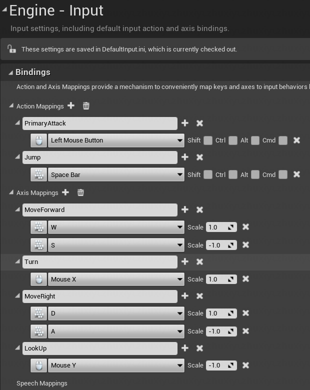
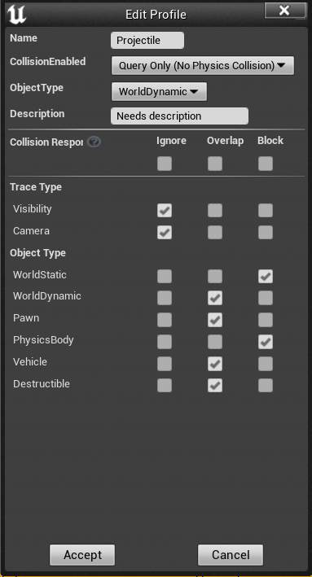
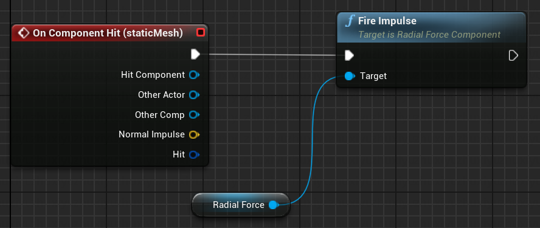

# ASSIGNMENT 1

## Setup Project in GitHub
Done

## Character with movement/look input
### Config keyboard inputs in project settings


### Implement the input handler functions in C++
1. binding the events function to the input events in project settings.
```c++
void AACharacter::SetupPlayerInputComponent(UInputComponent* PlayerInputComponent)
{
	Super::SetupPlayerInputComponent(PlayerInputComponent);
	
	PlayerInputComponent->BindAxis("MoveForward", this, &AACharacter::MoveForward);
	PlayerInputComponent->BindAxis("MoveRight", this, &AACharacter::MoveRight);

	PlayerInputComponent->BindAxis("Turn", this, &APawn::AddControllerYawInput);
	PlayerInputComponent->BindAxis("LookUp", this, &APawn::AddControllerPitchInput);

	PlayerInputComponent->BindAction("PrimaryAttack", IE_Pressed, this, &AACharacter::PrimaryAttack);
	PlayerInputComponent->BindAction("Jump", IE_Pressed, this, &AACharacter::Jump);
}
```
2. implement the handler functions. For example, the MoveForward() function:
```c++
void AACharacter::MoveForward(float Value)
{
	auto controlRot = GetControlRotation();
	controlRot.Pitch = 0.0f;
	controlRot.Roll = 0.0f;
	
	AddMovementInput(controlRot.Vector(), Value);
}
```

### Third Person Camera Implementation
1. Create a spring arm component to control the camera and set it attached by camera, using pawn controlled rotation.
```c++
SpringArmComp = CreateDefaultSubobject<USpringArmComponent>("SpringArmComp");
SpringArmComp->bUsePawnControlRotation = true;
SpringArmComp->SetupAttachment(RootComponent);
SpringArmComp->SetUsingAbsoluteRotation(true);

CameraComp = CreateDefaultSubobject<UCameraComponent>("CameraComp");
CameraComp->SetupAttachment(SpringArmComp);

GetCharacterMovement()->bOrientRotationToMovement = true;
bUseControllerRotationYaw = false;
```
For CharacterMovement Component, it needs auto orient to movement direction and cannot use controller rotation.

2. using controller rotation to move forward and right.
```
void AACharacter::MoveRight(float Value)
{
	auto controlRot = GetControlRotation();
	controlRot.Pitch = 0.0f;
	controlRot.Roll = 0.0f;
	// X Forward
	// Y Right
	// Z Up

	FVector RightVector = FRotationMatrix(controlRot).GetScaledAxis(EAxis::Y);
	AddMovementInput(RightVector, Value);
}
```

## Implement Magic Projectile
1. Create a new C++ class inherited from Actor, named AMagicProjectile. Add a static mesh component and a projectile movement component.
```c++
AAMagicProjectile::AAMagicProjectile()
{
	SphereComp = CreateDefaultSubobject<USphereComponent>("SphereComp");
	SphereComp->SetCollisionProfileName("Projectile");
	RootComponent = SphereComp;

	MovementComp = CreateDefaultSubobject<UProjectileMovementComponent>("MovementComp");

	ParticleComp = CreateDefaultSubobject<UParticleSystemComponent>("ParticleComp");
	ParticleComp->SetupAttachment(RootComponent);
}
```
It is also necessary to set the collision profile in project settings.


2. Create a blueprint inherited from AMagicProjectile, named BP_MagicProjectile. Set the static mesh and particle system and use 'P_Gideon_Primary_Projectile' as the particle.


## Bind Jumping via BindAction()
The way to bind jump is the same as binding primary attack. The only difference is that the jump function is in CharacterMovementComponent, not in Character class.
```c++
void AACharacter::Jump()
{
	Super::Jump();
	
	auto characterTrans = GetTransform();
	AddMovementInput(characterTrans.GetUnitAxis(EAxis::Z), 1.0f);
}
```

## Explosive Barrel re-implemented in C++
The BluePrint version of explosive barrel:

The C++ version of explosive barrel:
```c++
void AAExplosiveBarrel::PostInitializeComponents()
{
	Super::PostInitializeComponents();
	staticMesh->OnComponentHit.AddDynamic(this, &AAExplosiveBarrel::Onhit);
}

void AAExplosiveBarrel::Onhit(UPrimitiveComponent* HitComponent, AActor* OtherActor, UPrimitiveComponent* OtherComp, FVector NormalImpulse, const FHitResult& Hit)
{
	radialForce->FireImpulse();
}
```
The C++ version is much simpler than the BluePrint version.It need add a dynamic function to the OnComponentHit event in PostInitializeComponents() function. The Onhit() function is the handler function of the OnComponentHit event.

```c++
class ACTIONROGUELIKE_API AAExplosiveBarrel : public AActor
{
	GENERATED_BODY()
	
public:	
	// Sets default values for this actor's properties
	AAExplosiveBarrel();

protected:
    UFUNCTION()
	void Onhit(UPrimitiveComponent* HitComponent, AActor* OtherActor, UPrimitiveComponent* OtherComp,
	           FVector NormalImpulse,
	           const FHitResult& Hit);
};
```
Notice: the Onhit() function must be declared as UFUNCTION().Because `staticMesh->OnComponentHit.AddDynamic` is working at runtime. The UFUNCTION() macro will tell UE Reflection System to generate the reflection data for the function. When the actor is created at runtime, the reflection system will find the Onhit() function and bind it to the OnComponentHit event.

## UE Reflection System
### What is Reflection System
Reflection System is a system that can generate reflection data for C++ classes and functions. The reflection data is used to bind C++ functions to UE events at runtime. For example, the OnComponentHit event of a static mesh component. The OnComponentHit event is a delegate, which is a list of functions. When the static mesh component is hit, the delegate will call all the functions in the list. The reflection system will find the functions in the list by the reflection data.

### How to use Reflection System
1. UClASS() macro
```c++
UCLASS()
class ACTIONROGUELIKE_API AAExplosiveBarrel : public AActor
{
    GENERATED_BODY()
}
```
The UCLASS() macro will tell UE Reflection System to generate the reflection data for the class. The GENERATED_BODY() macro will tell UE Reflection System to generate the reflection data for the functions in the class.

2. UFUNCTION() macro
```c++
UFUNCTION()
void Onhit(UPrimitiveComponent* HitComponent, AActor* OtherActor, UPrimitiveComponent* OtherComp,
           FVector NormalImpulse,
           const FHitResult& Hit);
```
The UFUNCTION() macro will tell UE Reflection System to generate the reflection data for the function. The reflection data will be used to bind the function to UE events at runtime.

3. PROPERTY() macro
```c++
UPROPERTY(EditAnywhere, Category = "Components")
UStaticMeshComponent* staticMesh;
```
The reflection data will be used to bind the property to UE events at runtime. Can be used to bind the property to the property editor in UE Editor.

4. Reflection Setting
- EditAnywhere - edit in BP editor and per-instance in level.
- VisibleAnywhere - 'read-only' in editor and level. (Use for Components)
- EditDefaultsOnly - hide variable per-instance, edit in BP editor only
- VisibleDefaultsOnly - 'read-only' access for variable, only in BP editor (uncommon)
- EditInstanceOnly - allow only editing of instance (eg. when placed in level)
- BlueprintReadOnly - read-only in the Blueprint scripting (does not affect 'details'-panel)
- BlueprintReadWrite - read-write access in Blueprints
- Category = "" - display only for detail panels and blueprint context menu.

https://docs.unrealengine.com/5.0/en-US/reflection-system-in-unreal-engine/