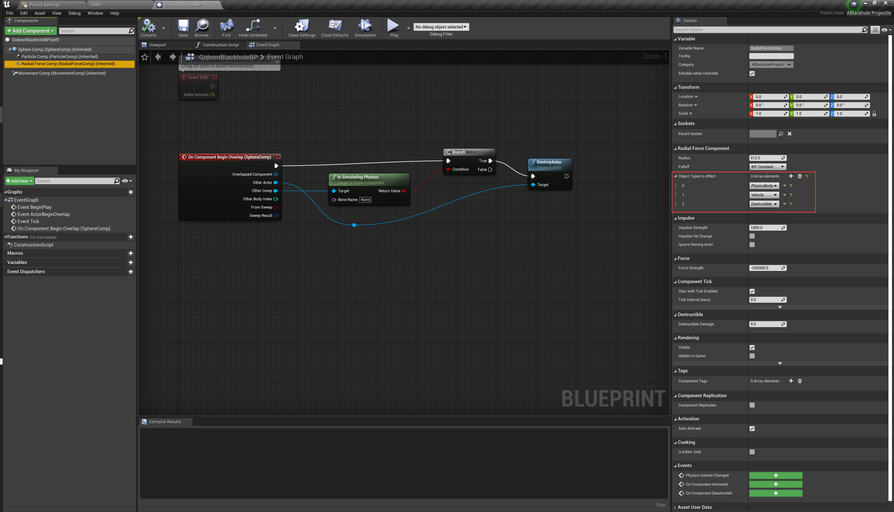

# ASSIGNMENT 2
## FIX'Projectile Direction - C++ (1/3)
### Rotate the Character to face hit direction
```c++
void AACharacter::PrimaryAttack()
{
	if(!GetWorldTimerManager().IsTimerActive(AttackTimerHandle))
	{
		auto cameraForward = CameraComp->GetForwardVector();
		auto rot = UKismetMathLibrary::MakeRotFromX(cameraForward);
		auto rawRot = GetActorRotation();
		rawRot.Yaw = rot.Yaw;
		SetActorRotation(rawRot);
		PlayAnimMontage(PrimaryAttackMontage);
		GetWorldTimerManager().SetTimer(AttackTimerHandle, this, &AACharacter::PrimaryAttack_TimeElapsed, 0.2f, false);
	}
}
```
When pressing the primary attack button, the character will rotate to face the direction of the camera's forward vector. This is done by getting the forward vector of the camera, making a rotation towards that direction, and then using the yaw of that rotation to set the character's rotation.

### Spwan projectile aiming at camera look on
Firstly, we need to create a new function to get the object that the camera is aiming at. The function will return a boolean value to indicate whether the line trace hit anything, and the hit point of the object that the camera is aiming at.
```c++
bool AACharacter::GetAimAt(FVector &aimAtLoc)
{
	auto cameraForward = CameraComp->GetForwardVector();
	
	FCollisionObjectQueryParams queryParams;
	FHitResult hit;
	FVector s = CameraComp->GetComponentLocation();
	FVector e = s + cameraForward * 5000;

	queryParams.ObjectTypesToQuery = ECC_TO_BITFIELD(ECC_WorldStatic)|ECC_TO_BITFIELD(ECC_WorldDynamic)
		|ECC_TO_BITFIELD(ECC_Pawn)|ECC_TO_BITFIELD(ECC_PhysicsBody);

	if(GetWorld()->LineTraceSingleByObjectType(hit, s, e, queryParams))
	{
		aimAtLoc = hit.ImpactPoint;
		return true;
	}
	aimAtLoc = cameraForward;
	return false;
}
```
This function will use a line trace to get the hit point of the object that the camera is aiming at. If the line trace doesn't hit anything, the function will return the camera's forward vector.

And we use the result of the function to spawn the projectile.
```c++
void AACharacter::PrimaryAttack_TimeElapsed()
{
	auto handLocaltion = GetMesh()->GetSocketLocation("Muzzle_01");
	
	FTransform SpawnTM;
	FVector hitLoc;
	if(GetAimAt(hitLoc))
	{
		SpawnTM = FTransform(UKismetMathLibrary::MakeRotFromX(hitLoc-handLocaltion), handLocaltion);
		DrawDebugLine(GetWorld(), handLocaltion, hitLoc, FColor::Red, false, 2.0f, 0, 1.0f);
	}
	else
	{
		SpawnTM = FTransform(UKismetMathLibrary::MakeRotFromX(hitLoc), handLocaltion);
	}
	
	FActorSpawnParameters SpawnParams;
	SpawnParams.SpawnCollisionHandlingOverride = ESpawnActorCollisionHandlingMethod::AlwaysSpawn;
	SpawnParams.Instigator = this;

	GetWorld()->SpawnActor(PrimaryAttackClass, &SpawnTM, SpawnParams);
}
```
If the line trace hit anything, the projectile will be spawned aiming at the hit point. If it does not hit, the projectile will be spawned aiming at the camera's forward vector. The spawning logic of BlackHoleAbility and DashAbility is implemented in the same way. The visual effect of fixed primary attack is show below.

## Blackhole Projectile - Blueprints (2/3)
```c++
AABlackholeProjectile::AABlackholeProjectile()
{
 	// Set this actor to call Tick() every frame.  You can turn this off to improve performance if you don't need it.
	PrimaryActorTick.bCanEverTick = true;

	SphereComp = CreateDefaultSubobject<USphereComponent>("SphereComp");
	MovementComp = CreateDefaultSubobject<UProjectileMovementComponent>("MovementComp");
	ParticleComp = CreateDefaultSubobject<UParticleSystemComponent>("ParticleComp");
	RadialForceComp = CreateDefaultSubobject<URadialForceComponent>("RadialForceComp");
    
	RootComponent = SphereComp;
	ParticleComp->SetupAttachment(RootComponent);
	RadialForceComp->SetupAttachment(RootComponent);
    
	RadialForceComp->Radius = 512.f;
	RadialForceComp->ForceStrength = -500000.f;
}
```
It need radial force component to simulate the blackhole effect. The radius and force strength are set to 512 and -500000 respectively. And it is nessary to set the object types to affect in the radial force component as below.



After that, we need to use blueprint to handle overlap event. Just destroy the actor when it overlaps with other actors.

## "Dash" Ability - C++ (3/3)
The initial implementation of the dash ability is same as the primary attack. But the dash ability needs to delay teleporting the character or immediately teleport the character when the projectile hits something. The delay is implemented by using a timer handle. Hitting event is through the OnComponentHit function. 
```c++
// Called when the game starts or when spawned
void AADashProjectile::BeginPlay()
{
	Super::BeginPlay();
	SphereComp->OnComponentHit.AddDynamic(this, &AADashProjectile::OnComponentHit);
	GetWorldTimerManager().SetTimer(DashDelayHandle, this, &AADashProjectile::Teleport, 0.4f, false);
}

void AADashProjectile::OnComponentHit(UPrimitiveComponent* HitComponent, AActor* OtherActor,
	UPrimitiveComponent* OtherComp, FVector NormalImpulse, const FHitResult& Hit)
{
	UGameplayStatics::SpawnEmitterAtLocation(GetWorld(), HitParticle, GetActorLocation());
	if(!GetWorldTimerManager().IsTimerActive(TeleportDelayHandle))
	{
		GetWorldTimerManager().SetTimer(TeleportDelayHandle, this, &AADashProjectile::Teleport, 0.1f, false);
	}
}

void AADashProjectile::Teleport()
{
	auto instigator = this->GetInstigator();
	if (instigator)
	{
		UGameplayStatics::SpawnEmitterAtLocation(GetWorld(), TeleportEnterParticle, GetActorLocation());
		UGameplayStatics::SpawnEmitterAtLocation(GetWorld(), TeleportExitParticle, instigator->GetActorLocation());
		auto rot = UKismetMathLibrary::MakeRotFromX(GetActorForwardVector());
		auto rawRot = instigator->GetActorRotation();
		rawRot.Yaw = rot.Yaw;
		
		instigator->SetActorLocation(GetActorLocation());
		instigator->SetActorRotation(rawRot);
	}
	Destroy();
}
```
The teleport function will spawn the teleport effect and set the character's location and rotation to the projectile's location and rotation. When the instigating character is teleported, the projectile will be destroyed. The visual effect of the dash ability is shown below.


## End
My Github Repository:

[ActionRoguelike](https://github.com/kyrosz7u/ActionRoguelike)

