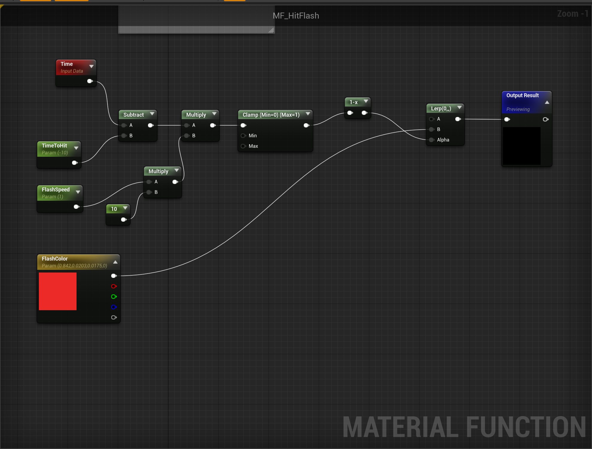
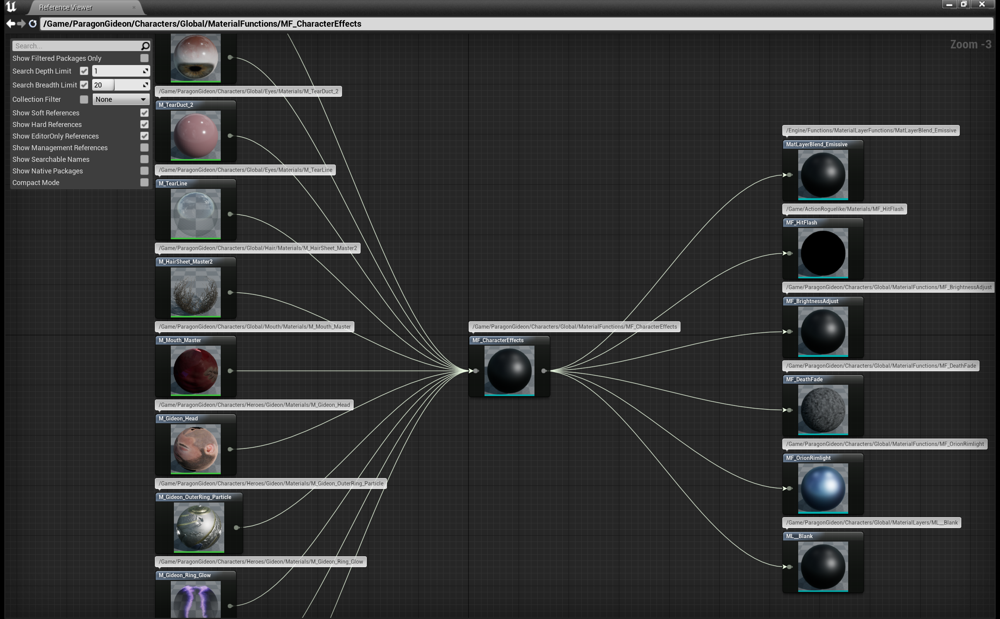
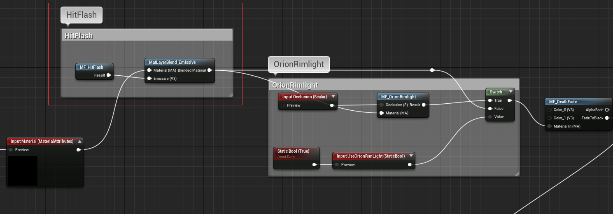

# ASSIGNMENT 3

## (1 of 2)

### Magic Projectile - Add audio playback

Using UAudioComponent to play a sound while the projectile flying. When it hits something, play an impact sound.

#### Looped ‘flight’ sound

```c++
AAMagicProjectile::AAMagicProjectile()
{
    AttachedAudioComponent = CreateDefaultSubobject<UAudioComponent>("AttachedAudioComponent");
    AttachedAudioComponent->SetupAttachment(RootComponent);
}
```

#### Impact sound

```c++
void AAMagicProjectile::PostInitializeComponents()
{
    Super::PostInitializeComponents();
  
    AttachedAudioComponent->Sound = FlySound;
    AttachedAudioComponent->bAutoActivate = true;
    AttachedAudioComponent->bAutoDestroy = true;
    AttachedAudioComponent->Play();
}
```

### Player Character

#### Add ‘Hit Flash’ material nodes to existing Player Material

First, create tweakable 'Color' and 'Speed' parameters in the material function.


Second, embed the material function in the player character material. Through querying unreal reference viewer, we can find the all of the character's material instances using MF_CharacterEffects function. So we can add the 'Hit Flash' effect logic to MF_CharacterEffects blueprint function.



And then, modify the MF_CharacterEffects function to include the 'Hit Flash' effect.



At last, trigger the 'Hit Flash' effect in the player character C++ Class.

```c++
void AACharacter::OnHealthChange(AActor* InstigatorActor, UAAttributeComponent* OwningComp, float NewValue,
	float MaxValue, float Delta)
{
	GetMesh()->SetScalarParameterValueOnMaterials("TimeToHit", GetWorld()->GetTimeSeconds());
    // ``````
}
```

### AttributeComponent

#### Add ‘HealthMax’ attribute

First, Replace ‘ClassDefaults: Health’ node in Health Widget with new ‘HealthMax’ attribute
```c++
UCLASS( ClassGroup=(Custom), meta=(BlueprintSpawnableComponent), DisplayName="Attribute Component")
class ACTIONROGUELIKE_API UAAttributeComponent : public UActorComponent
{
    GENERATED_BODY()
public:	
    // Sets default values for this component's properties
    UAAttributeComponent();

protected:
    UPROPERTY(EditDefaultsOnly, BlueprintReadOnly, Catego  ry="Attributes")
    float MaxHealth;
    
    UPROPERTY(EditDefaultsOnly, BlueprintReadOnly, Category="Attributes")
    float Health;
}
```
Second, Clamp ‘Health’ attribute between 0 and ‘HealthMax’ via ApplyHealthChanges
```c++
void UAAttributeComponent::ApplyHealthChanged(AActor* instigator, float delta)
{
    Health += delta;
    Health = FMath::Clamp(Health,0.0f, MaxHealth);
    
    OnHealthChange.Broadcast(instigator, this, Health, MaxHealth, delta);
}
```

### UI

#### Add ‘Damage amount’ to the new damage widget. (use ‘Expose on Spawn’ to set value)


#### Add Animation to ‘Damage Widget’ when added to viewport.. (Change Color, Scale)

## (2 of 2)

### Goal: ‘Health Potion’ power-up Actor in level to heal ‘Pawn’

### Magic Projectile
