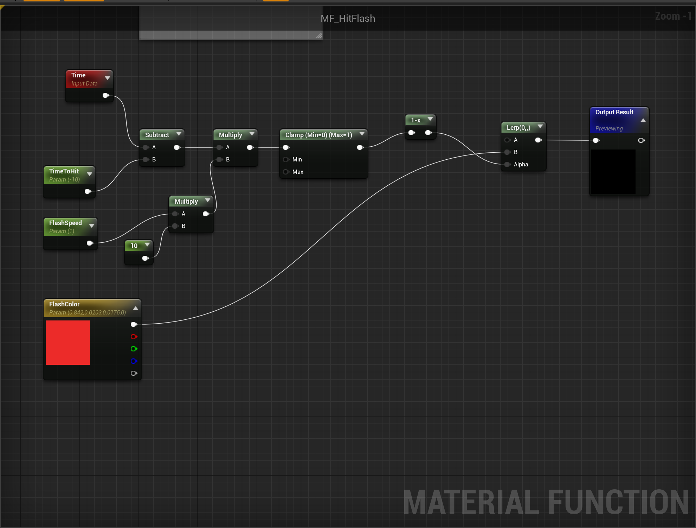
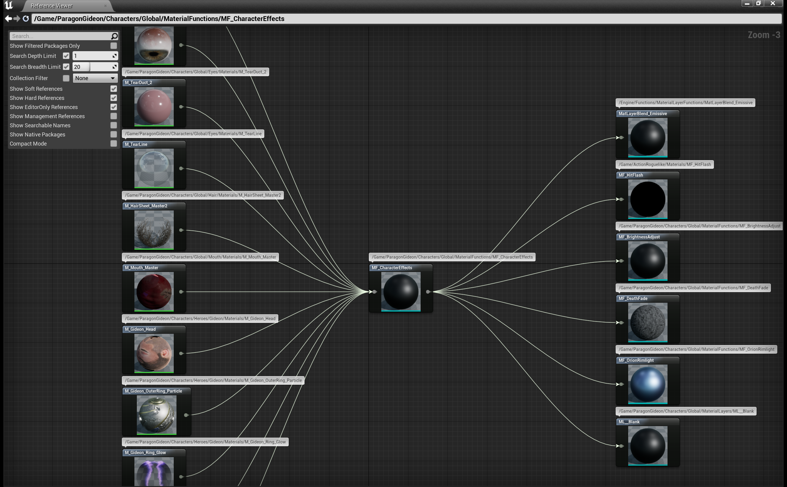
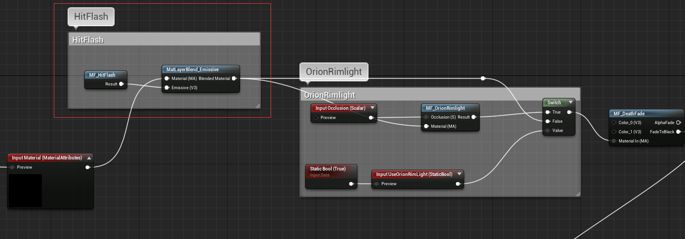

# ASSIGNMENT 3

## (1 of 2)

### Magic Projectile - Add audio playback

Using UAudioComponent to play a sound while the projectile flying. When it hits something, play an impact sound.

#### Looped ‘flight’ sound

```c++
AAMagicProjectile::AAMagicProjectile()
{
    AttachedAudioComponent = CreateDefaultSubobject<UAudioComponent>("AttachedAudioComponent");
    AttachedAudioComponent->SetupAttachment(RootComponent);
}
```

#### Impact sound

```c++
void AAMagicProjectile::PostInitializeComponents()
{
    Super::PostInitializeComponents();
  
    AttachedAudioComponent->Sound = FlySound;
    AttachedAudioComponent->bAutoActivate = true;
    AttachedAudioComponent->bAutoDestroy = true;
    AttachedAudioComponent->Play();
}
```

### Player Character

#### Add ‘Hit Flash’ material nodes to existing Player Material

First, create tweakable 'Color' and 'Speed' parameters in the material function.


Second, embed the material function in the player character material. Through querying unreal reference viewer, we can find the all of the character's material instances using MF_CharacterEffects function. So we can add the 'Hit Flash' effect logic to MF_CharacterEffects blueprint function.



And then, modify the MF_CharacterEffects function to include the 'Hit Flash' effect.



At last, trigger the 'Hit Flash' effect in the player character C++ Class.

```c++
void AACharacter::OnHealthChange(AActor* InstigatorActor, UAAttributeComponent* OwningComp, float NewValue,
	float MaxValue, float Delta)
{
	GetMesh()->SetScalarParameterValueOnMaterials("TimeToHit", GetWorld()->GetTimeSeconds());
    // ``````
}
```

### AttributeComponent

#### Add ‘HealthMax’ attribute

First, Replace ‘ClassDefaults: Health’ node in Health Widget with new ‘HealthMax’ attribute

```c++
UCLASS( ClassGroup=(Custom), meta=(BlueprintSpawnableComponent), DisplayName="Attribute Component")
class ACTIONROGUELIKE_API UAAttributeComponent : public UActorComponent
{
    GENERATED_BODY()
public:
    // Sets default values for this component's properties
    UAAttributeComponent();

protected:
    UPROPERTY(EditDefaultsOnly, BlueprintReadOnly, Catego  ry="Attributes")
    float MaxHealth;
  
    UPROPERTY(EditDefaultsOnly, BlueprintReadOnly, Category="Attributes")
    float Health;
}
```

Second, Clamp ‘Health’ attribute between 0 and ‘HealthMax’ via ApplyHealthChanges

```c++
void UAAttributeComponent::ApplyHealthChanged(AActor* instigator, float delta)
{
    Health += delta;
    Health = FMath::Clamp(Health,0.0f, MaxHealth);
  
    OnHealthChange.Broadcast(instigator, this, Health, MaxHealth, delta);
}
```

### UI

#### Add ‘Damage amount’ to the new damage widget. (use ‘Expose on Spawn’ to set value)

```c++
UCLASS()
class ACTIONROGUELIKE_API UADamagePopupUI : public UUserWidget
{
	GENERATED_BODY()

protected:
	// https://www.cnblogs.com/sin998/p/15390903.html
	UPROPERTY(meta=(BindWidget))
	UTextBlock *DamageText;

	UPROPERTY(Transient, meta = (BindWidgetAnim))
	UWidgetAnimation *PulseAnim;

	UPROPERTY(BlueprintReadWrite, Category="UIAttributes", meta=(ExposeOnSpawn=true))
	AActor* AttachedActor;

	UPROPERTY(BlueprintReadWrite, Category="UIAttributes", meta=(ExposeOnSpawn=true))
	float DamageAmount;
};
```

Add DamageAmount variable to the damage widget class, and set it to be exposed on spawn. In the AICharacter BP, we can set the value of the damage amount when we create the UI widget to the viewport. And then, DamageText and PulseAnim need to bind to the widget in the UI designer.

#### Add Animation to ‘Damage Widget’ when added to viewport. (Change Color, Scale)


```c++
void UADamagePopupUI::NativeConstruct()
{
	Super::NativeConstruct();

	PlayAnimation(PulseAnim, 0.0f, 1, EUMGSequencePlayMode::Forward, 1.0f);
	GetWorld()->GetTimerManager().SetTimer(TimerHandle, this, &UADamagePopupUI::DestroySelf, Duration, false);
}
```
Add the UI animation to the damage widget. The animation will change the color and scale of the widget. When the widget is created, the animation will be played and using a timer destroy the widget after a certain amount of time. 
## (2 of 2)

### Goal: ‘Health Potion’ power-up Actor in level to heal ‘Pawn’

#### Create a common base class for all power-ups

```c++
// AAPowerUpActor.h
UCLASS()
class ACTIONROGUELIKE_API AAPowerUpActor : public AActor, public IAGameplayInterface
{
	GENERATED_BODY()
	
public:	
	// Sets default values for this actor's properties
	AAPowerUpActor();
	void OnRep_IsActive();
	void ShowPowerup();
	void HideAndCooldownPowerup();
protected:
	UPROPERTY(EditAnywhere, Category = "Powerup")
	float RespawnTime;

	bool bIsActive;

	UPROPERTY(VisibleAnywhere, Category = "Components")
	USphereComponent* SphereComp;

	UPROPERTY(VisibleAnywhere, Category = "Components")
	UStaticMeshComponent* MeshComp;
};

// AAPowerUpActor.cpp
AAPowerUpActor::AAPowerUpActor()
{
 	// Set this actor to call Tick() every frame.  You can turn this off to improve performance if you don't need it.
	PrimaryActorTick.bCanEverTick = true;
	
	SphereComp = CreateDefaultSubobject<USphereComponent>("SphereComp");
	SphereComp->SetCollisionProfileName("PowerUpActor");
	RootComponent = SphereComp;

	MeshComp = CreateDefaultSubobject<UStaticMeshComponent>("MeshComp");
	// Disable collision, instead we use SphereComp to handle interaction queries
	MeshComp->SetCollisionEnabled(ECollisionEnabled::NoCollision);
	MeshComp->SetupAttachment(RootComponent);

	RespawnTime = 10.0f;
	bIsActive = true;
}

void AAPowerUpActor::OnRep_IsActive()
{
	SetActorEnableCollision(bIsActive);
	// Set visibility on root and all children
	RootComponent->SetVisibility(bIsActive, true);
}

void AAPowerUpActor::ShowPowerup()
{
	bIsActive = true;
	OnRep_IsActive();
}

void AAPowerUpActor::HideAndCooldownPowerup()
{
	bIsActive = false;
	OnRep_IsActive();

	GetWorldTimerManager().SetTimer(TimerHandle_RespawnTimer, this, &AAPowerUpActor::ShowPowerup, RespawnTime);
}
```
When the power-up is picked up, it will hide and start a cooldown timer. After waiting for the cooldown time, the power-up will show up and enable again. The common power-up class inherits a Gameplay Interface and does not implementation function. It means that the class is a incomplete class and the derived class must implement the interface.

#### Create a health power-up Actor
This is a common C++ class for all health power-ups logic. It will give health to the pawn when picked up. As above, it impelements the IAGameplayInterface to handle the health power-up logic.

```c++
void AAHealthPowerUpActor::Interact_Implementation(APawn* InstigatorPawn)
{
	if(!ensure(InstigatorPawn))
	{
		return ;
	}

	auto AttributeComp = InstigatorPawn->FindComponentByClass<UAAttributeComponent>();
	
	if(ensure(AttributeComp) && !AttributeComp->IsHealthFull())
    {
        auto ret = AttributeComp->ApplyHealthChanged(this, AttributeComp->GetHealthMax());
		if(ret)
		{
			HideAndCooldownPowerup();
		}
    }
}
```
### Magic Projectile
#### Create common base class for all projectiles
The common class has basic components for projectile, such as Sphere Collision, Particle System and Attached Audio Component. It also has some variables to tweak the projectile's behavior, such as VFX, Sound, Camera Shake. The Explode function is a BlueprintNativeEvent, it can be used to handle the hit logic in the child class.

```c++
UCLASS()
class ACTIONROGUELIKE_API AAProjectileBase : public AActor
{
	GENERATED_BODY()
public:
	UFUNCTION()
	virtual void OnComponentHit(UPrimitiveComponent* HitComponent, AActor* OtherActor, UPrimitiveComponent* OtherComp,
	                            FVector NormalImpulse, const FHitResult& Hit);

	// BlueprintNativeEvent = C++ base implementation, can be expanded in Blueprints
	// BlueprintCallable to allow child classes to trigger explosions
	// Not required for assignment, useful for expanding in Blueprint later on
	UFUNCTION(BlueprintCallable, BlueprintNativeEvent)
	void Explode();
	
protected:
	UPROPERTY(VisibleAnywhere, BlueprintReadOnly)
	USphereComponent* SphereComp;

	UPROPERTY(VisibleAnywhere)
	UProjectileMovementComponent *MovementComp;

	UPROPERTY(VisibleAnywhere)
	UParticleSystemComponent *ParticleComp;

	UPROPERTY(VisibleAnywhere)
	UAudioComponent *AttachedAudioComponent;

	UPROPERTY(EditAnywhere, Category="Effects|VFX")
	UParticleSystem* HitParticle;

	UPROPERTY(EditAnywhere, Category = "Effects|Sound Cue")
	USoundCue *FlySound;
	
	UPROPERTY(EditAnywhere, Category = "Effects|Sound Cue")
	USoundCue *HitSound;

	UPROPERTY(EditDefaultsOnly, Category = "Effects|Camera Shake")
	TSubclassOf<UCameraShakeBase> HitShake;

	UPROPERTY(EditDefaultsOnly, Category = "Effects|Camera Shake")
	float HitShakeInnerRadius;

	UPROPERTY(EditDefaultsOnly, Category = "Effects|Camera Shake")
	float HitShakeOuterRadius;

};
```
And in child class dash DashProjectile, we can override the Explode function to handle the hit logic.

```c++
void AADashProjectile::Explode_Implementation()
{
	UGameplayStatics::SpawnEmitterAtLocation(GetWorld(), HitParticle, GetActorLocation(), FRotator::ZeroRotator, FVector(0.5f));
	UGameplayStatics::PlaySoundAtLocation(this, HitSound, GetActorLocation());
	UGameplayStatics::PlayWorldCameraShake(this, HitShake, GetActorLocation(), HitShakeInnerRadius, HitShakeOuterRadius);
	UGameplayStatics::SpawnEmitterAtLocation(GetWorld(), HitParticle, GetActorLocation());
	if(!GetWorldTimerManager().IsTimerActive(TeleportDelayHandle))
	{
		GetWorldTimerManager().SetTimer(TeleportDelayHandle, this, &AADashProjectile::Teleport, 0.1f, false);
	}
}

void AADashProjectile::Teleport()
{
	auto instigator = this->GetInstigator();
	if (instigator)
	{
		UGameplayStatics::SpawnEmitterAtLocation(GetWorld(), TeleportEnterParticle, GetActorLocation());
		UGameplayStatics::SpawnEmitterAtLocation(GetWorld(), TeleportExitParticle, instigator->GetActorLocation());
		auto rot = UKismetMathLibrary::MakeRotFromX(GetActorForwardVector());
		auto rawRot = instigator->GetActorRotation();
		rawRot.Yaw = rot.Yaw;
		
		instigator->SetActorLocation(GetActorLocation());
		instigator->SetActorRotation(rawRot);

		auto pc = Cast<APlayerController>(instigator->GetInstigatorController());
		if(pc && pc->IsLocalController())
		{
			pc->ClientStartCameraShake(HitShake);
		}
	}
	Destroy();
}
```
After teleporting the player and playing the teleport particle effect. We can invoke the camera shake function ``pc->ClientStartCameraShake`` to add a camera shake effect to the player's camera. The camera shake effect is only visible to the local player.


## End
My Github Repository:

[ActionRoguelike](https://github.com/kyrosz7u/ActionRoguelike)


